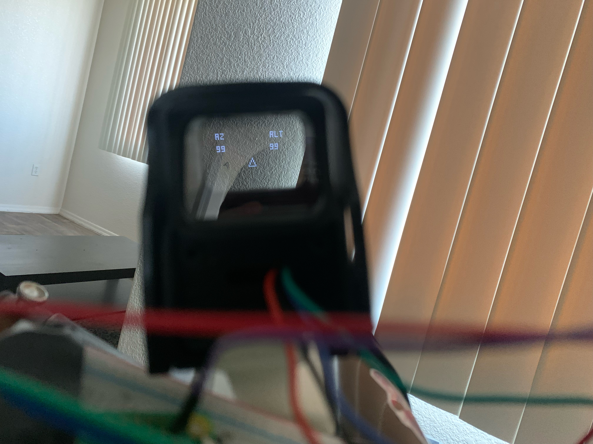

# lyn

~~~
                          :::     :::   ::: ::::    :::                    
     :+:     :+:         :+:     :+:   :+: :+:+:   :+:         :+:     :+: 
      +:+ +:+           +:+      +:+ +:+  :+:+:+  +:+           +:+ +:+    
  +#++:++#++:++        +#+       +#++:   +#+ +:+ +#+        +#++:++#++:++  
    +#+ +#+           +#+        +#+    +#+  +#+#+#           +#+ +#+      
 #+#     #+#         #+#        #+#    #+#   #+#+#         #+#     #+#     
                    ########## ###    ###    ####                          
~~~

A [plate solving](https://en.wikipedia.org/wiki/Astrometric_solving), orientation resolving device meant to be mounted on a telescope, with augmented reality. The eventual goal is to have markers overlaid where the celestial object would be when looking through the sight, so that the observer intuitively can place the object in the telescope's field of view. Altitude and azumith are computed with plate solving, and an IMU will interpolate any adjustment between image exposures and solves. Currently, the code for the IMU is being finalized (which will most likely become available as a C++ library in a seperate repo, since it's proven difficult to find one). The plate solving and camera integration will be completed next.

*The current altitude and azumith are displayed (degrees) and the reticle is adjustable in software*

*Still a very rough prototype :)*
